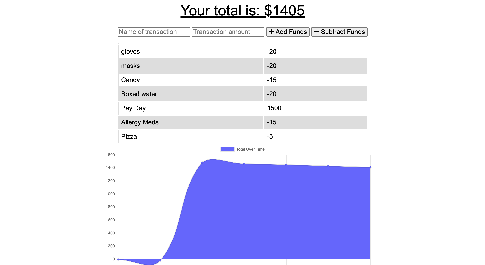

# Budgetornot-

## Description 

An Budget Calculator app than can be used to track transactions overtime. This is a PWA so these functions will work offline and update the database once back online. Check it out here [here]()

## Usage 

Below is an image of the dashboard which includes the budget calculator and displays a graph of transactions made overtime. 

    

## Questions
 Please forward any questions to [email(fay.ashbrgmail.com) . Please refer to the code for this project and others at [https://github.com/afbrown1216](https://github.com/afbrown1216).

## License 

Copyright (c) afbrown1216. 
Licensed under the MIT license.